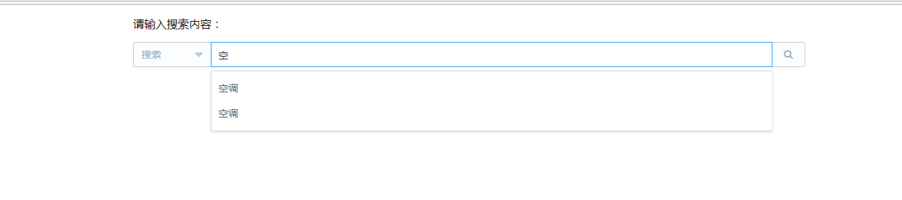

# cargo-management

> cargo-management

## Build Setup

``` bash
# install dependencies
npm install

# serve with hot reload at localhost:8080
npm run dev

# build for production with minification
npm run build

```

商品管理系统
# 简介：
本项目是基于vue、typescript、nodejs、mysql的商品管理系统。
针对于商品信息的录入/删除/修改/查询。
增加了一些便于操作的设置，如标签功能、筛选功能、高级搜索（关键字搜索）、自动补全搜索等。

# 环境需求：
* node环境
* mysql环境

# 启动
示例数据库位置 nodeService/database/*.sql
服务端service nodeService、nodeService.js
数据库配置 nodeService/mqsql/mqsql.js

#功能介绍

* 自动补全


* 快捷搜索


* 新建产品


* 输入验证


* 搜索结果


* 新建产品标签


* 品牌筛选（可筛选范围为当前列表中已有的品牌）


For a detailed explanation on how things work, check out the [guide](http://vuejs-templates.github.io/webpack/) and [docs for vue-loader](http://vuejs.github.io/vue-loader).
